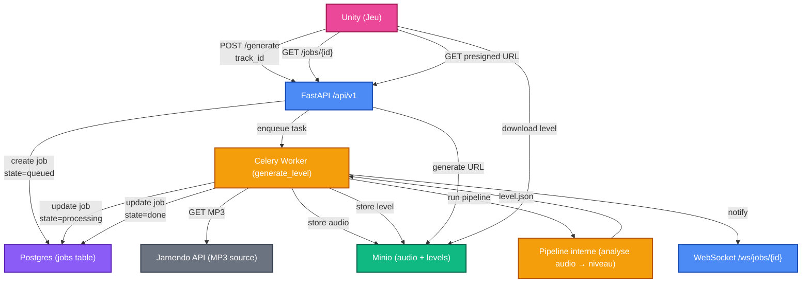

```mermaid
flowchart TD

    %% STYLE
    classDef api fill:#4C8BF5,stroke:#1A4BB3,stroke-width:2px,color:white
    classDef worker fill:#F59E0B,stroke:#B45309,stroke-width:2px,color:white
    classDef storage fill:#10B981,stroke:#065F46,stroke-width:2px,color:white
    classDef external fill:#6B7280,stroke:#374151,stroke-width:2px,color:white
    classDef db fill:#8B5CF6,stroke:#5B21B6,stroke-width:2px,color:white
    classDef client fill:#EC4899,stroke:#9D174D,stroke-width:2px,color:white

    %% CLIENT
    Unity["Unity (Jeu)"]:::client

    %% API
    FastAPI["FastAPI /api/v1"]:::api
    WS["WebSocket /ws/jobs/{id}"]:::api

    %% WORKERS
    Celery["Celery Worker (generate_level)"]:::worker

    %% STORAGE
    Minio["Minio (audio + levels)"]:::storage

    %% DB
    Postgres["Postgres (jobs table)"]:::db

    %% EXTERNAL
    Jamendo["Jamendo API (MP3 source)"]:::external

    %% PIPELINE
    Pipeline["Pipeline interne (analyse audio → niveau)"]:::worker

    %% FLOWS
    Unity -->|"POST /generate\ntrack_id"| FastAPI
    FastAPI -->|"create job\nstate=queued"| Postgres
    FastAPI -->|"enqueue task"| Celery

    Celery -->|"GET MP3"| Jamendo
    Celery -->|"store audio"| Minio
    Celery -->|"update job\nstate=processing"| Postgres

    Celery -->|"run pipeline"| Pipeline
    Pipeline -->|"level.json"| Celery

    Celery -->|"store level"| Minio
    Celery -->|"update job\nstate=done"| Postgres
    Celery -->|"notify"| WS

    Unity -->|"GET /jobs/{id}"| FastAPI
    Unity -->|"GET presigned URL"| FastAPI
    FastAPI -->|"generate URL"| Minio
    Unity -->|"download level"| Minio

```
