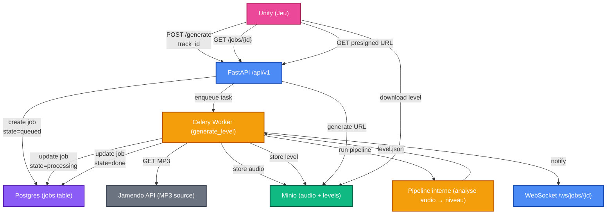

# Guide de lancement

## Prérequis

Tu dois être **dans le Dev Container** (VS Code → Command Palette → `Dev Containers: Reopen in Container`).

Le `docker-compose.yml` lance automatiquement les services suivants en arrière-plan :

| Service | Rôle | Port |
|---------|------|------|
| **db** | PostgreSQL 15 | 5432 (interne) |
| **redis** | Broker Celery | 6379 (interne) |
| **minio** | Stockage objets (audio + levels) | 9000 (API) / 9001 (console) |

Tu n'as pas besoin de les démarrer manuellement — ils tournent dès l'ouverture du container.

## Étape 1 — Charger les variables d'environnement

Toutes les commandes ci-dessous supposent que les variables du `.env` sont chargées dans le shell. Exécute ceci **une seule fois par terminal** :

```bash
set -a && source .env && set +a
```

> **Pourquoi ?** Les fichiers Python utilisent `pydantic-settings` qui lit `.env` automatiquement, mais les outils CLI comme `celery` et `alembic` ont besoin que les variables soient dans l'environnement du shell.

## Étape 2 — Appliquer les migrations (base de données)

Crée ou met à jour les tables dans Postgres :

```bash
alembic upgrade head
```

Les tables créées : `users`, `jobs`, `music`, `playlists`, `tracks`.

> Tu ne dois faire ça qu'une fois en général, ou après un `alembic revision --autogenerate -m "description"` si tu as modifié un model.

## Étape 3 — Lancer l'API (FastAPI)

```bash
uvicorn src.api.main:app --reload
```

- L'API écoute sur `http://127.0.0.1:8000`
- `--reload` relance automatiquement le serveur quand tu modifies un fichier Python
- La doc Swagger est disponible sur `http://127.0.0.1:8000/docs`

## Étape 4 — Lancer le worker Celery

**Dans un second terminal** (toujours dans le container) :

```bash
set -a && source .env && set +a
celery -A src.api.core.celery_app worker --loglevel=info
```

Le worker doit afficher `[tasks] . generate_level` dans sa bannière de démarrage. C'est lui qui exécute les tâches lourdes (téléchargement audio, pipeline, upload MinIO).

## Tester le flux complet

### 1. Lancer une génération

```bash
curl -X POST http://localhost:8000/api/v1/generate \
  -H "Content-Type: application/json" \
  -d '{"track_id": "1890"}'
```

Réponse attendue :
```json
{
  "job_id": "xxxxxxxx-xxxx-xxxx-xxxx-xxxxxxxxxxxx",
  "state": "pending"
}
```

### 2. Suivre l'avancement du job

```bash
curl http://localhost:8000/api/v1/jobs/<job_id>
```

Réponse selon l'état :
```json
{
  "job_id": "...",
  "state": "running",
  "progress": 0,
  "result_url": null
}
```

Quand `state` passe à `completed`, le champ `result_url` contient une URL présignée MinIO pour télécharger le `level.json`.

### 3. Console MinIO (optionnel)

La console web MinIO est accessible sur `http://localhost:9001` (login: `minio` / `minio123`). Tu peux y voir les fichiers uploadés dans les buckets `audio` et `levels`.

---

## Comment ça fonctionne — flux détaillé

```
Unity                    FastAPI                 Postgres       Celery Worker         Jamendo         MinIO
  │                        │                       │                │                   │              │
  │── POST /generate ─────▶│                       │                │                   │              │
  │   {track_id: "1890"}   │── INSERT job ────────▶│                │                   │              │
  │                        │   (state=pending)     │                │                   │              │
  │                        │── .delay(job_id) ────────────────────▶│                   │              │
  │◀── {job_id, "pending"} │                       │                │                   │              │
  │                        │                       │                │                   │              │
  │                        │                       │◀── UPDATE ─────│                   │              │
  │                        │                       │  state=running │                   │              │
  │                        │                       │                │── GET /tracks ───▶│              │
  │                        │                       │                │◀── audio URL ─────│              │
  │                        │                       │                │── download MP3 ──▶│              │
  │                        │                       │                │                   │              │
  │                        │                       │                │── upload audio ──────────────────▶│
  │                        │                       │                │                   │              │
  │                        │                       │                │── run pipeline ──▶│              │
  │                        │                       │                │◀── level.json ────│              │
  │                        │                       │                │                   │              │
  │                        │                       │                │── upload level ──────────────────▶│
  │                        │                       │◀── UPDATE ─────│                   │              │
  │                        │                       │  state=done    │                   │              │
  │                        │                       │  result_path   │                   │              │
  │                        │                       │                │                   │              │
  │── GET /jobs/{id} ─────▶│                       │                │                   │              │
  │                        │── SELECT job ────────▶│                │                   │              │
  │                        │◀─────────────────────│                │                   │              │
  │                        │── presigned URL ─────────────────────────────────────────▶│              │
  │◀── {state, result_url} │                       │                │                   │              │
  │                        │                       │                │                   │              │
  │── download level.json ────────────────────────────────────────────────────────────▶│              │
```

### Résumé des composants

| Composant | Techno | Rôle |
|-----------|--------|------|
| **API** | FastAPI + Uvicorn | Reçoit les requêtes HTTP/WebSocket de Unity, crée les jobs, retourne les résultats |
| **Worker** | Celery + Redis | Exécute les tâches lourdes en arrière-plan (download, pipeline, upload) |
| **Base de données** | PostgreSQL | Stocke l'état des jobs (`pending` → `running` → `completed`/`failed`) |
| **Stockage** | MinIO (S3-compatible) | Stocke les fichiers audio (MP3) et les niveaux générés (JSON) |
| **Jamendo** | API externe | Source des morceaux audio (MP3 libre de droits) |
| **Pipeline** | `src.pipeline` (librosa, numpy, scipy) | Analyse audio → génération du niveau (JSON) |

### Les 3 process à lancer

| Terminal | Commande | Ce qu'il fait |
|----------|----------|---------------|
| 1 | `uvicorn src.api.main:app --reload` | API HTTP — reçoit les requêtes |
| 2 | `celery -A src.api.core.celery_app worker --loglevel=info` | Worker — exécute les tâches |
| (auto) | PostgreSQL, Redis, MinIO | Lancés par Docker Compose |

---


## Architecture de l'API (Backend)

Cette API sert de pont entre le jeu Unity et la base de données PostgreSQL. Elle utilise une architecture en couches pour séparer la logique de données, la logique métier et les points d'entrée (endpoints).

### Structure des Répertoires

#### `api/core`

C'est le cœur de la configuration du système.

- **config.py** : Centralise les variables d'environnement (identifiants DB, clés secrètes, configuration S3/MinIO).
- **celery_app.py** : Configuration des tâches asynchrones (pour les calculs longs qui ne doivent pas bloquer le jeu).

#### `api/db` (Data Layer)

Tout ce qui touche à la persistance des données.

- **migrations/** : Historique des versions de la base de données (géré par Alembic).
- **models/** : Contient les définitions SQLAlchemy (User.py, Job.py). C'est le reflet fidèle de tes tables SQL.
- **repositories/** : Couche d'accès aux données. Elle contient les requêtes SQL complexes pour isoler la base de données du reste du code.
- **session.py** : Gère la connexion et le cycle de vie des sessions avec PostgreSQL.

#### `api/routers` (Endpoints)

Ce sont les portes d'entrée de l'API pour Unity.

- **jobs.py** : Routes pour suivre l'avancement des tâches (ex: `/jobs/{id}`).
- **generate.py** : Routes pour lancer de nouvelles actions de génération d'assets ou de données.

#### `api/schemas` (Validation)

Utilise Pydantic pour définir le format des données JSON.

- Ils garantissent que les données envoyées par Unity sont correctes.
- Ils servent à générer automatiquement la documentation Swagger.

#### `api/services` (Business Logic)

Contient la logique métier.

- Si une action demande de calculer des statistiques, de contacter une API externe (comme Jamendo) ou de transformer des données, cela se passe ici.

#### `api/utils`

Regroupe les outils transversaux.

- **websocket_manager.py** : Gère les connexions en temps réel pour notifier Unity dès qu'un évènement survient sur le serveur.

### Flux d'une requête

1. Unity envoie une requête HTTP.
2. Le Router réceptionne et valide les données via un Schema.
3. Le Service exécute la logique métier nécessaire.
4. Le Repository enregistre ou récupère les informations via le Model.
5. La réponse est renvoyée à Unity en format JSON.

---

## Changelog — Ce qui a été corrigé et implémenté

### 1. Correction des models SQLAlchemy (Base partagée)

**Fichiers** : `db/models/User.py`, `db/models/Job.py`

**Problème** : chaque model créait son propre `Base = declarative_base()` au lieu d'utiliser celui défini dans `db/models/base.py`. Conséquence : `Base.metadata` ne contenait pas toutes les tables, Alembic ne pouvait pas les détecter, et les relations entre models étaient cassées.

**Correction** : suppression du `declarative_base()` local dans chaque fichier, remplacement par `from .base import Base`. Tous les models (`User`, `Job`, `Music`, `Playlist`, `Track`) héritent maintenant du même `Base` central.

### 2. Correction de `get_session()` (générateur FastAPI)

**Fichier** : `db/session.py`

**Problème** : la fonction retournait `SessionLocal()` directement. Utilisée avec `Depends()`, la session n'était jamais fermée après la requête (fuite de connexions).

**Correction** : transformée en générateur Python (`yield`) avec un bloc `try/finally` qui garantit `db.close()` :

```python
def get_session() -> Generator[Session, None, None]:
    db = SessionLocal()
    try:
        yield db
    finally:
        db.close()
```

### 3. Correction des imports dans `user_repo.py`

**Fichier** : `db/repositories/user_repo.py`

**Problème** : le fichier utilisait `Session` et `User` sans les importer. Tout import du module provoquait un `NameError`.

**Correction** : ajout de `from sqlalchemy.orm import Session` et `from src.api.db.models import User` en tête de fichier.

### 4. Correction des imports dans `migrations/env.py`

**Fichier** : `db/migrations/env.py`

**Problème** : les imports utilisaient `from api.core.config import ...` et `from api.db.models import ...`, ce qui échouait depuis la racine du projet (le module s'appelle `src.api`, pas `api`).

**Correction** : remplacé par `from src.api.core.config import get_settings` et `from src.api.db.models import Base`.

### 5. Création de `alembic.ini` et structure de migrations

**Fichiers créés** :
- `alembic.ini` (racine du projet) : pointe `script_location` vers `src/api/db/migrations`
- `src/api/db/migrations/script.py.mako` : template Mako pour générer les fichiers de migration
- `src/api/db/migrations/versions/` : répertoire des migrations versionnées

**Migration initiale** générée avec `alembic revision --autogenerate -m "initial tables"` puis appliquée avec `alembic upgrade head`. Tables créées dans Postgres : `users`, `jobs`, `music`, `playlists`, `tracks`.

### 6. Correction de `StorageService` (endpoint MinIO)

**Fichier** : `services/storage.py`

**Problème** : `MINIO_ENDPOINT` dans `.env` vaut `http://minio:9000`, mais le client `Minio()` attend le hostname:port seul (`minio:9000`), sans schéma.

**Correction** : ajout d'un strip du préfixe `http://` ou `https://` avant de passer l'endpoint au client :

```python
endpoint = settings.MINIO_ENDPOINT
if endpoint.startswith("http://"):
    endpoint = endpoint[len("http://"):]
elif endpoint.startswith("https://"):
    endpoint = endpoint[len("https://"):]
```

### 7. Définition des schemas Pydantic

**Fichiers** : `schemas/generate.py`, `schemas/jobs.py`

**Avant** : fichiers vides (commentaire seulement).

**Après** :
- `schemas/generate.py` définit `GenerateRequest` (champ `track_id: str`) et `GenerateResponse` (champs `job_id`, `state`)
- `schemas/jobs.py` définit `JobResponse` (champs `job_id`, `state`, `progress`, `result_url`)

Ces schemas sont utilisés par les routers pour valider le JSON entrant et structurer la réponse, et apparaissent dans la doc Swagger.

### 8. Implémentation de la tâche Celery `generate_level`

**Fichier créé** : `services/tasks.py`

**Contenu** : une tâche Celery `@app.task(name="generate_level")` qui exécute le flux complet :

1. Passe le job en état `RUNNING` dans Postgres
2. Télécharge le MP3 via le service Jamendo (`services/jamendo.py`)
3. Upload l'audio dans le bucket `audio` de MinIO
4. Lance le pipeline d'analyse audio (`src.pipeline.main`)
5. Upload le `level.json` résultant dans le bucket `levels` de MinIO
6. Met à jour le `result_path` du job et passe l'état à `COMPLETED`
7. En cas d'erreur, passe l'état à `FAILED`

**Enregistrement** : ajout de `include=["src.api.services.tasks"]` dans `celery_app.py` pour que le worker découvre la tâche au démarrage.

### 9. Implémentation du service Jamendo

**Fichier** : `services/jamendo.py` (était vide)

**Contenu** : fonction `download_track(track_id, dest_path)` qui :

1. Appelle l'API Jamendo (`/v3.0/tracks`) avec le `JAMENDO_CLIENT_ID` des settings
2. Récupère l'URL de téléchargement audio (`audiodownload`)
3. Streame le fichier MP3 et l'écrit sur disque à `dest_path`

### 10. Câblage de l'endpoint `POST /generate`

**Fichier** : `routers/generate.py`

**Avant** : placeholder qui retournait `{"message": "generation started"}` sans paramètres.

**Après** : endpoint complet qui :

1. Accepte un body JSON validé par `GenerateRequest` (`track_id` requis)
2. Génère un `job_id` (UUID v4)
3. Crée une entrée job dans Postgres via `job_repo.create_job()`
4. Envoie la tâche Celery `generate_level_task.delay(job_id, track_id)`
5. Retourne un `GenerateResponse` avec `job_id` et `state="pending"`

### 11. Correction du `.env` (variables Celery)

**Fichier** : `.env`

**Problème** : `CELERY_BROKER_URL=redis://${REDIS_HOST}:${REDIS_PORT}/${REDIS_DB}` utilisait une interpolation bash `${}` qui n'est pas supportée par `python-dotenv` ni par `env_file:` de Docker Compose. Résultat : le port arrivait comme la chaîne littérale `${REDIS_PORT}`, provoquant un `ValueError` au démarrage de Celery.

**Correction** : suppression des variables `CELERY_BROKER_URL` et `CELERY_RESULT_BACKEND` du `.env`. Le fichier `celery_app.py` construit déjà l'URL correctement à partir des variables individuelles `REDIS_HOST`, `REDIS_PORT`, `REDIS_DB`.

---

## État actuel — Ce qui fonctionne

| Composant | Statut |
|-----------|--------|
| `uvicorn src.api.main:app --reload` | ✅ Démarre sans erreur |
| `celery -A src.api.core.celery_app worker --loglevel=info` | ✅ Démarre, découvre la tâche `generate_level` |
| `alembic upgrade head` | ✅ Migration appliquée, 5 tables créées |
| `POST /api/v1/generate` | ✅ Crée un job + envoie tâche Celery |
| `GET /api/v1/jobs/{id}` | ✅ Retourne l'état d'un job |
| Schemas Pydantic | ✅ Validation + doc Swagger |
| Service Jamendo | ✅ Téléchargement MP3 implémenté |
| Service Storage (MinIO) | ✅ Upload/download/presigned URL |

---

## Étapes restantes — Roadmap

### Étape 6 — Intégrer le pipeline audio

**Objectif** : connecter la tâche Celery au pipeline `src.pipeline`.

La tâche `generate_level` dans `services/tasks.py` appelle déjà `from src.pipeline.main import main as run_pipeline`, mais le pipeline doit :

1. Accepter un chemin de fichier MP3 en paramètre et retourner un `dict` (le level JSON).
2. Si le pipeline actuel écrit directement dans un fichier, adapter `run_pipeline(audio_path)` pour qu'il retourne les données au lieu d'écrire sur disque.
3. Tester avec un vrai `track_id` Jamendo :
   ```bash
   curl -X POST http://localhost:8000/api/v1/generate \
     -H "Content-Type: application/json" \
     -d '{"track_id": "1234"}'
   ```

### Étape 7 — WebSocket notification

**Objectif** : Unity reçoit une notification quand le job est terminé.

**Attention** : Celery tourne dans un process séparé — il ne peut pas accéder directement au `WebSocketManager` de l'API. Solutions possibles :

1. **Pub/Sub Redis** : la tâche Celery publie un message sur un channel Redis → l'API écoute via un background task et fait `ws_manager.broadcast()`.
2. **Polling simple** (plus rapide à implémenter) : Unity appelle `GET /jobs/{id}` périodiquement jusqu'à `state=completed`.

### Étape 8 — Tests

1. Tests unitaires pour les repositories : `tests/test_job_repo.py`
2. Tests d'intégration pour les endpoints : `tests/test_generate.py`, `tests/test_jobs.py` (avec `httpx.AsyncClient`)
3. Lancement : `pytest tests/ -v`
