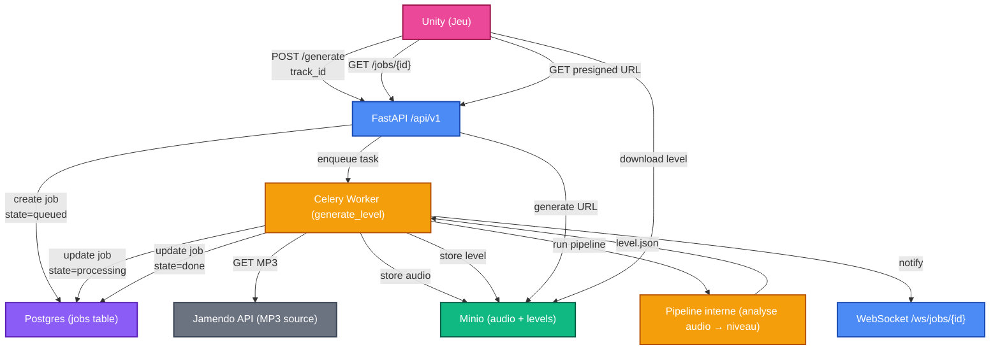

# lancer l'api
```bash
uvicorn src.api.main:app --reload
```

# doc générée par swagger UI
```bash
http://127.0.0.1:8000/docs#/
```
# endpoint generate

```bash
curl -X POST http://localhost:8000/api/v1/generate
```


# lancer celery
```bash
set -a && source .env && set +a
celery -A src.api.core.celery_app worker --loglevel=info
```
## Architecture de l'API (Backend)

Cette API sert de pont entre le jeu Unity et la base de données PostgreSQL. Elle utilise une architecture en couches pour séparer la logique de données, la logique métier et les points d'entrée (endpoints).

### Structure des Répertoires

#### `api/core`

C'est le cœur de la configuration du système.

- **config.py** : Centralise les variables d'environnement (identifiants DB, clés secrètes, configuration S3/MinIO).
- **celery_app.py** : Configuration des tâches asynchrones (pour les calculs longs qui ne doivent pas bloquer le jeu).

#### `api/db` (Data Layer)

Tout ce qui touche à la persistance des données.

- **migrations/** : Historique des versions de la base de données (géré par Alembic).
- **models/** : Contient les définitions SQLAlchemy (User.py, Job.py). C'est le reflet fidèle de tes tables SQL.
- **repositories/** : Couche d'accès aux données. Elle contient les requêtes SQL complexes pour isoler la base de données du reste du code.
- **session.py** : Gère la connexion et le cycle de vie des sessions avec PostgreSQL.

#### `api/routers` (Endpoints)

Ce sont les portes d'entrée de l'API pour Unity.

- **jobs.py** : Routes pour suivre l'avancement des tâches (ex: `/jobs/{id}`).
- **generate.py** : Routes pour lancer de nouvelles actions de génération d'assets ou de données.

#### `api/schemas` (Validation)

Utilise Pydantic pour définir le format des données JSON.

- Ils garantissent que les données envoyées par Unity sont correctes.
- Ils servent à générer automatiquement la documentation Swagger.

#### `api/services` (Business Logic)

Contient la logique métier.

- Si une action demande de calculer des statistiques, de contacter une API externe (comme Jamendo) ou de transformer des données, cela se passe ici.

#### `api/utils`

Regroupe les outils transversaux.

- **websocket_manager.py** : Gère les connexions en temps réel pour notifier Unity dès qu'un évènement survient sur le serveur.

### Flux d'une requête

1. Unity envoie une requête HTTP.
2. Le Router réceptionne et valide les données via un Schema.
3. Le Service exécute la logique métier nécessaire.
4. Le Repository enregistre ou récupère les informations via le Model.
5. La réponse est renvoyée à Unity en format JSON.
