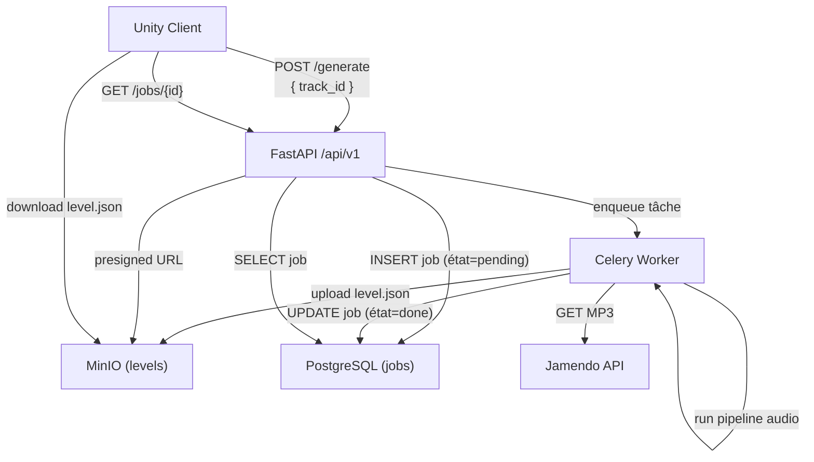

# API Backend

La documentation complète de l'API REST est maintenue dans le dépôt backend :

[floorian651/pulsedash_backend](https://github.com/floorian651/pulsedash_backend)

Une fois le backend démarré localement, la documentation Swagger interactive est disponible sur :

```
http://127.0.0.1:8000/docs
```

## Flux d'appels depuis Unity



## Endpoints consommés par Unity

| Méthode | Route | Description |
|---|---|---|
| `POST` | `/api/v1/generate` | Lance la génération d'un niveau |
| `GET` | `/api/v1/jobs/{job_id}` | Consulte l'état d'un job |

Pour le détail des schémas de requête/réponse, voir [Schéma des données](data-schema.md).
