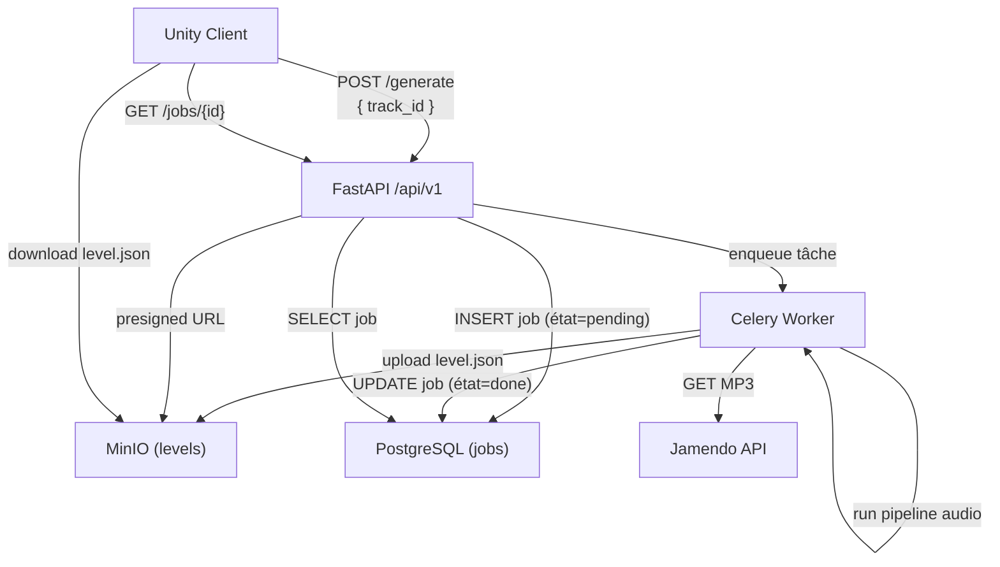

# API Backend

La documentation complète de l'API REST est maintenue dans le dépôt backend :

[floorian651/pulsedash_backend](https://github.com/floorian651/pulsedash_backend)

Une fois le backend démarré localement, la documentation Swagger interactive est disponible sur :

```
http://127.0.0.1:8000/docs
```

## Flux d'appels depuis Unity



## Endpoints consommés par Unity

| Méthode | Route | Description |
|---|---|---|
| `POST` | `/api/v1/generate` | Lance la génération d'un niveau |
| `GET` | `/api/v1/jobs/{job_id}` | Consulte l'état d'un job |

Pour le détail des schémas de requête/réponse, voir [Schéma des données](data-schema.md).

# Connexion API au frontend

Résumé des travaux — Intégration backend PulseDash
                                
  Contexte

  Connexion du client Unity au backend FastAPI dans le cadre du projet PulseDash, un jeu de rythme 3D à génération procédurale. Les travaux ont porté sur la branche lien_bdd_page_connexion (9 commits).

  ---
  Audit initial
  
  Avant de coder, un audit technique complet a été réalisé produisant 5 documents : roadmap priorisée, backlog de tâches atomiques, recensement de la dette technique, description d'architecture, et liste de quick wins. Cet
   audit a identifié les zones critiques : génération de niveau non connectée, gestion d'URL incohérente, score non transmis, et plusieurs problèmes de sécurité.

  ---
  Travaux réalisés

  1. Unification de la configuration réseau

  Deux systèmes d'URL coexistaient (ApiManager hardcodé, DotEnv lisant les variables d'environnement). Tous les DAOs ont été centralisés sur ApiManager comme source de vérité unique. DotEnv.cs a été supprimé.

  2. Connexion de la génération de niveau au backend

  La génération procédurale lisait des fichiers JSON locaux. Elle appelle désormais le pipeline backend : POST /api/v1/generate suivi d'un polling GET /api/v1/generate/{job_id} (timeout à 2 min). Le niveau est généré à
  partir de l'analyse audio réelle du morceau.

  3. Envoi du score final

  À la fin d'une partie, le score n'était pas transmis. Deux nouveaux endpoints ont été intégrés : POST /api/v1/game-sessions au démarrage, et PATCH /api/v1/game-sessions/{id}/end avec le score final à l'arrivée. La
  navigation vers l'écran de fin n'est pas bloquée par la réponse réseau.

  4. Correction du bug static maxEnergy

  Le champ maxEnergy du joueur était static, partagé entre toutes les instances. Converti en champ d'instance, ce qui évite la persistance incorrecte de l'énergie entre sessions.

  5. Gestion d'erreur réseau

  Absence de feedback utilisateur sur les erreurs réseau. ApiClient détecte désormais les ConnectionError et affiche une popup "Serveur inaccessible" sur tous les appels HTTP, sans modifier les signatures des DAOs.

  6. Synchronisation des playlists

  Les playlists étaient persistées dans un fichier JSON local. Elles sont maintenant synchronisées avec le backend via 5 endpoints REST (CRUD playlists + tracks). Le cache en mémoire est mis à jour de façon pessimiste
  (uniquement sur succès API).

  7. Recherche musicale Jamendo

  La recherche ne fonctionnait que sur des assets Unity locaux. Elle propose désormais deux sources : les MP3 déjà cachés localement (persistentDataPath), et une recherche live via GET /api/v1/jamendo/search. La sélection
  d'un résultat Jamendo déclenche l'import backend (POST /api/v1/jamendo/import/{id}), le téléchargement et la mise en cache du MP3, puis la lecture immédiate.

  8. Déconnexion automatique
  ---
  Résultats

  ┌──────────────────────────────┬─────────┬───────────────────────────────────────────────────┐
  │           Métrique           │  Avant  │                       Après                       │
  ├──────────────────────────────┼─────────┼───────────────────────────────────────────────────┤
  │ Endpoints backend intégrés   │ 4       │ 18                                                │
  ├──────────────────────────────┼─────────┼───────────────────────────────────────────────────┤
  │ Tâches P0 résolues           │ 0       │ 6                                                 │
  ├──────────────────────────────┼─────────┼───────────────────────────────────────────────────┤
  │ Fichiers créés               │ —       │ 3 (GameSessionDAO, PlaylistDAO, MusicDAO réécrit) │
  ├──────────────────────────────┼─────────┼───────────────────────────────────────────────────┤
  │ Bug de sécurité (logs JWT)   │ Présent │ Supprimé                                          │
  ├──────────────────────────────┼─────────┼───────────────────────────────────────────────────┤
  │ Génération niveau depuis API │ Non     │ Oui                                               │
  └──────────────────────────────┴─────────┴───────────────────────────────────────────────────┘