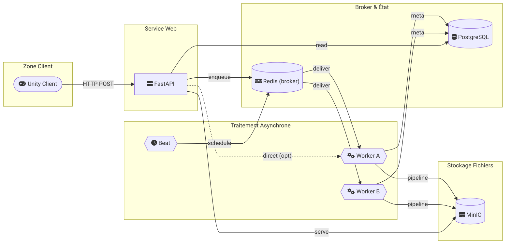
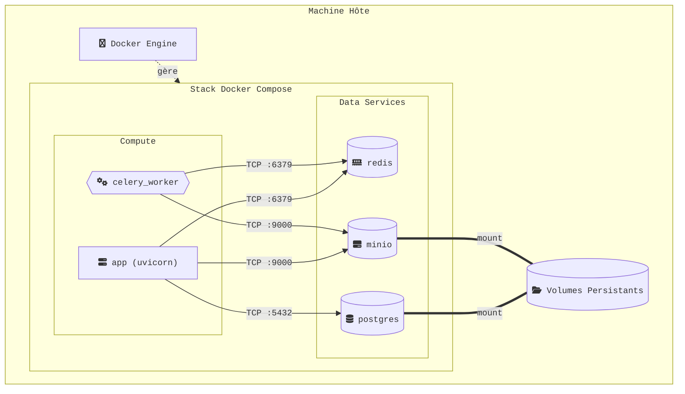

## Architecture

Ce document décrit l'architecture logique et l'architecture de déploiement du projet. Les schémas ci‑dessous montrent le flux principal entre le client Unity, l'API FastAPI, le broker Redis, les workers asynchrones, et les services de stockage et de base de données.

## Architecture logique

### Rôles des composants

- **Client Unity** : envoie les requêtes (ex. upload, paramètres d'analyse) et consomme les résultats.
- **API FastAPI** : point d'entrée HTTP. Valide les requêtes, déclenche le traitement asynchrone, et sert les résultats.
- **Redis (broker)** : file d'attente pour les tâches Celery, assurant le découplage entre API et workers.
- **Workers Celery** : exécutent les pipelines de traitement (analyse, transformation, génération de métadonnées).
- **PostgreSQL** : stocke les métadonnées, états des jobs et résultats structurés.
- **MinIO** : stockage objet des fichiers d'entrée/sortie (ex. artefacts, exports, ressources).
- **Beat** : ordonnance les tâches planifiées (jobs récurrents, nettoyage, re‑traitements).

### Flux principal

1. Le **client Unity** envoie une requête HTTP à l'**API**.
2. L'**API** enregistre la requête et la **met en file** via **Redis**.
3. Les **workers** consomment la tâche, exécutent le pipeline, stockent les artefacts dans **MinIO** et les métadonnées dans **PostgreSQL**.
4. L'**API** récupère et sert les résultats au client (lecture en base et fichiers via MinIO).

## Architecture de déploiement

### Principes

- Les services sont **conteneurisés** et orchestrés via **Docker Compose**.
- L'API et les workers partagent le broker Redis et le stockage objet MinIO.
- Les volumes persistants garantissent la durabilité des données (PostgreSQL et MinIO).

### Réseaux et ports

- **Redis** : port 6379 (broker Celery)
- **PostgreSQL** : port 5432 (métadonnées)
- **MinIO** : port 9000 (stockage objet)

