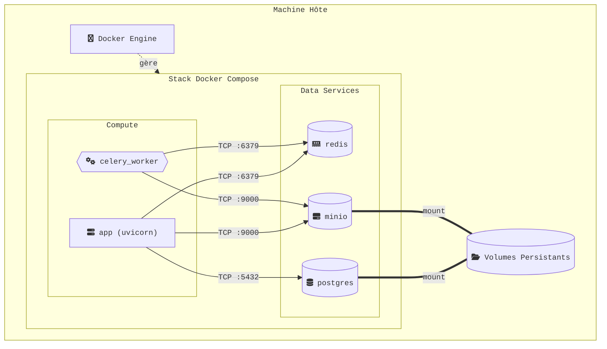

```mermaid
%%{init: {'themeVariables': { 'fontFamily': 'Roboto', 'fontSize': '14px'}, 'flowchart': { 'curve': 'monotoneX' } } }%%
flowchart LR
  subgraph Client [ Zone Client ]
    Unity(["fa:fa-gamepad Unity Client"])
  end

  subgraph API_Service [ Service Web ]
    API["fa:fa-server FastAPI"]
  end

  subgraph Broker_Backend [ Broker & État ]
    Redis[("fa:fa-memory Redis (broker)")]
    Postgres[("fa:fa-database PostgreSQL")]
  end

  subgraph Workers [ Traitement Asynchrone ]
    Worker1{{"fa:fa-cogs Worker A"}}
    Worker2{{"fa:fa-cogs Worker B"}}
    Beat{{"fa:fa-clock Beat"}}
  end

  subgraph Storage [ Stockage Fichiers ]
    MinIO[("fa:fa-hdd MinIO")]
  end

  Unity -->|"HTTP POST"| API
  API -->|"enqueue"| Redis
  API -.->|"direct (opt)"| Worker1
  Beat -->|"schedule"| Redis
  Redis -->|"deliver"| Worker1
  Redis -->|"deliver"| Worker2
  Worker1 -->|"pipeline"| MinIO
  Worker2 -->|"pipeline"| MinIO
  Worker1 -->|"meta"| Postgres
  Worker2 -->|"meta"| Postgres
  API -->|"read"| Postgres
  API -->|"serve"| MinIO
```

```mermaid
%%{init: {'themeVariables': { 'fontFamily': 'Fira Code, Consolas, Monaco, monospace', 'fontSize': '13px'}, 'flowchart': { 'curve': 'basis' } } }%%
flowchart TD
  subgraph Host [ Machine Hôte ]
    DockerEngine["fa:fa-docker Docker Engine"]

    subgraph ComposeStack [ Stack Docker Compose ]
        direction TB

        subgraph Compute [ Compute ]
            app["fa:fa-server app (uvicorn)"]
            worker{{"fa:fa-cogs celery_worker"}}
        end

        subgraph DataServices [ Data Services ]
            redis[("fa:fa-memory redis")]
            db[("fa:fa-database postgres")]
            minio[("fa:fa-hdd minio")]
        end
    end

    Volumes[("fa:fa-folder-open Volumes Persistants")]
  end

  DockerEngine -.->|"gère"| ComposeStack

  app -->|"TCP :6379"| redis
  app -->|"TCP :5432"| db
  app -->|"TCP :9000"| minio

  worker -->|"TCP :6379"| redis
  worker -->|"TCP :9000"| minio

  db ===|"mount"| Volumes
  minio ===|"mount"| Volumes
```
