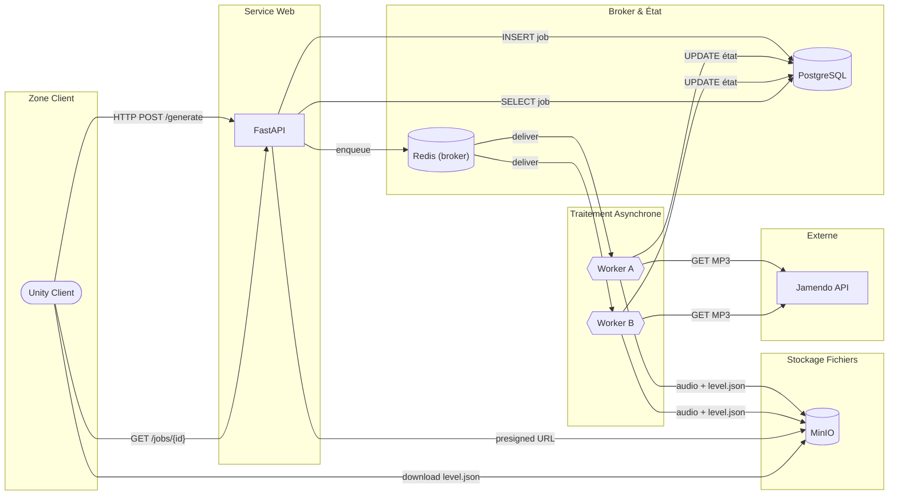
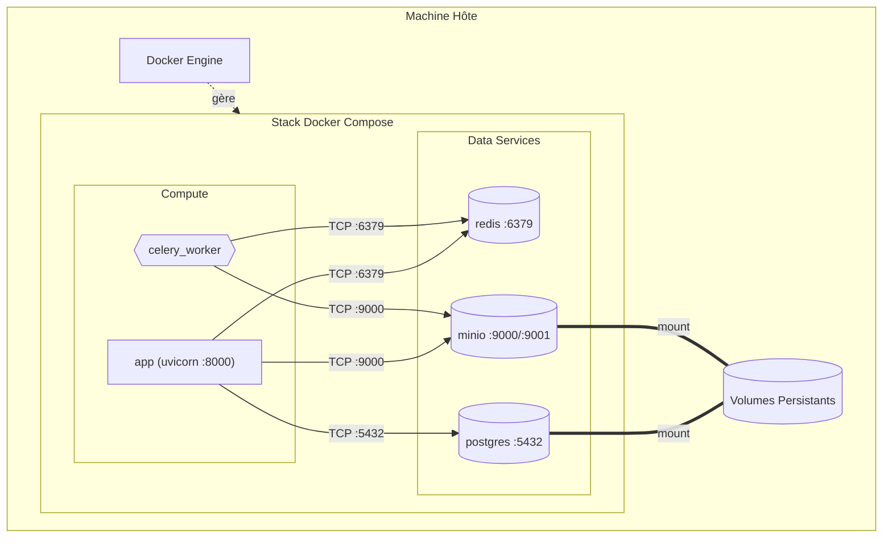

## Architecture

Ce document décrit l'architecture logique et le schéma de déploiement du projet PulseDash. Le projet est organisé en deux dépôts indépendants : le présent dépôt héberge le **client Unity**, le second héberge le **backend** (API, workers, base de données, stockage).

- Dépôt backend : [floorian651/pulsedash_backend](https://github.com/floorian651/pulsedash_backend)

## Architecture logique

### Rôles des composants

- **Client Unity** : envoie les requêtes (génération de niveau, récupération de résultats) et consomme le fichier `level.json` pour piloter le gameplay.
- **API FastAPI** : point d'entrée HTTP. Valide les requêtes, crée les jobs, déclenche le traitement asynchrone et sert les résultats.
- **Redis (broker)** : file d'attente pour les tâches Celery, assurant le découplage entre l'API et les workers.
- **Workers Celery** : exécutent le pipeline de traitement (téléchargement audio, analyse, génération du niveau JSON).
- **PostgreSQL** : stocke l'état des jobs (`pending` → `running` → `done` / `failed`) et les métadonnées.
- **MinIO** : stockage objet des fichiers d'entrée/sortie (audio MP3, niveaux JSON).
- **Jamendo API** : source externe de morceaux audio libres de droits.

### Flux principal

```mermaid
%%{init: {'themeVariables': { 'fontFamily': 'Roboto', 'fontSize': '14px'}, 'flowchart': { 'curve': 'monotoneX' } } }%%
flowchart LR
  subgraph Client [ Zone Client ]
    Unity(["Unity Client"])
  end

  subgraph API_Service [ Service Web ]
    API["FastAPI"]
  end

  subgraph Broker_Backend [ Broker & État ]
    Redis[("Redis (broker)")]
    Postgres[("PostgreSQL")]
  end

  subgraph Workers [ Traitement Asynchrone ]
    Worker1{{"Worker A"}}
    Worker2{{"Worker B"}}
  end

  subgraph Storage [ Stockage Fichiers ]
    MinIO[("MinIO")]
  end

  subgraph External [ Externe ]
    Jamendo["Jamendo API"]
  end

  Unity -->|"HTTP POST /generate"| API
  API -->|"INSERT job"| Postgres
  API -->|"enqueue"| Redis
  Redis -->|"deliver"| Worker1
  Redis -->|"deliver"| Worker2
  Worker1 -->|"GET MP3"| Jamendo
  Worker2 -->|"GET MP3"| Jamendo
  Worker1 -->|"audio + level.json"| MinIO
  Worker2 -->|"audio + level.json"| MinIO
  Worker1 -->|"UPDATE état"| Postgres
  Worker2 -->|"UPDATE état"| Postgres
  API -->|"SELECT job"| Postgres
  API -->|"presigned URL"| MinIO
  Unity -->|"GET /jobs/{id}"| API
  Unity -->|"download level.json"| MinIO
```

## Architecture de déploiement

### Principes

- Le backend est entièrement **conteneurisé** et orchestré via **Docker Compose**.
- L'API et les workers partagent le broker Redis et le stockage objet MinIO.
- Les volumes persistants garantissent la durabilité des données (PostgreSQL et MinIO).
- Le client Unity est développé et compilé séparément via Unity Hub.

### Réseaux et ports (Backend)

| Service | Port | Rôle |
|---|---|---|
| API (Uvicorn) | 8000 | Point d'entrée HTTP |
| Redis | 6379 | Broker Celery |
| PostgreSQL | 5432 | Métadonnées |
| MinIO API | 9000 | Stockage objet |
| MinIO Console | 9001 | Interface web d'administration |

```mermaid
%%{init: {'themeVariables': { 'fontFamily': 'Fira Code, Consolas, Monaco, monospace', 'fontSize': '13px'}, 'flowchart': { 'curve': 'basis' } } }%%
flowchart TD
  subgraph Host [ Machine Hôte ]
    DockerEngine["Docker Engine"]

    subgraph ComposeStack [ Stack Docker Compose ]
        direction TB

        subgraph Compute [ Compute ]
            app["app (uvicorn :8000)"]
            worker{{"celery_worker"}}
        end

        subgraph DataServices [ Data Services ]
            redis[("redis :6379")]
            db[("postgres :5432")]
            minio[("minio :9000/:9001")]
        end
    end

    Volumes[("Volumes Persistants")]
  end

  DockerEngine -.->|"gère"| ComposeStack

  app -->|"TCP :6379"| redis
  app -->|"TCP :5432"| db
  app -->|"TCP :9000"| minio

  worker -->|"TCP :6379"| redis
  worker -->|"TCP :9000"| minio

  db ===|"mount"| Volumes
  minio ===|"mount"| Volumes
```
