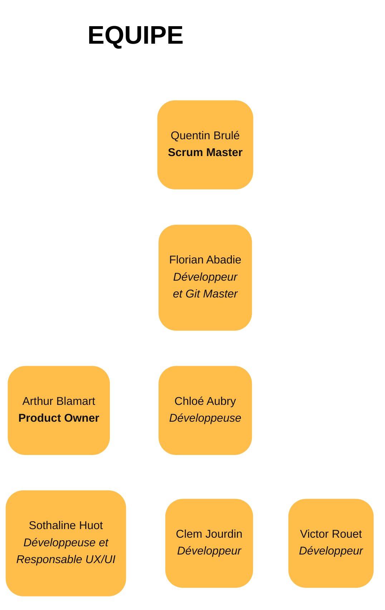

# Documentation
## Planification du projet

|  | N ° semaine |  |  |  |  |  |  |  |  |  |  |  |
| --- | --- | --- | --- | --- | --- | --- | --- | --- | --- | --- | --- | --- |
| Lot | 46 | 48 | 50 | 2 | 3 | 5 | 7 | 10 | 12 | 14 | 18 | 21 |
| Gestion de projet | 3 | 2 | 1 | 1 | 1 | 1 | 1 | 1 | 1 | 1 | 2 | 2 |
| Plateforme de streaming | 1 | 1 | 1 | 1 | 1 | 1 | 1 | 1 | 1 | 1 | 1 | 1 |
| Jeux vidéo | 2 | 2 | 3 | 3 | 3 | 2 | 2 | 2 | 2 | 2 | 1 | 1 |
| Base de données | 0 | 0 | 0 | 0 | 0 | 2 | 2 | 2 | 2 | 2 | 2 | 2 |
| Génération de niveau par la musique | 0 | 1 | 1 | 1 | 1 | 0 | 0 | 0 | 0 | 0 | 0 | 0 |
|  | 6 | 6 | 6 | 6 | 6 | 6 | 6 | 6 | 6 | 6 | 6 | 6 |

## Organisation de l'équipe

