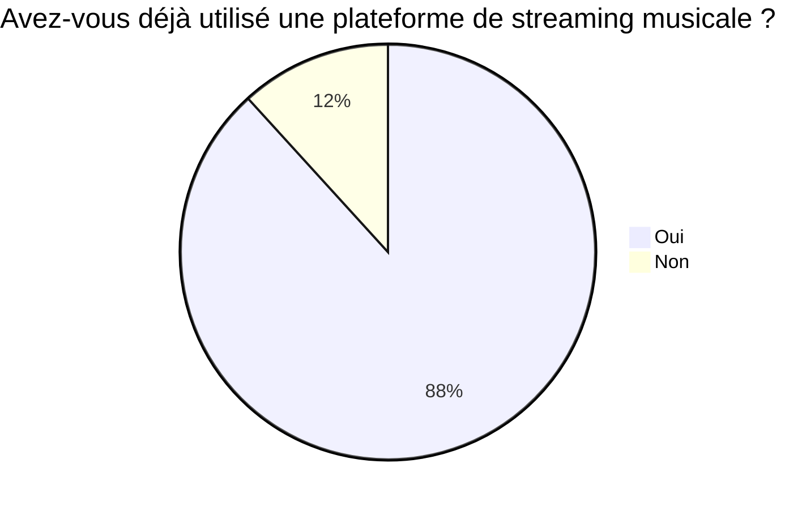
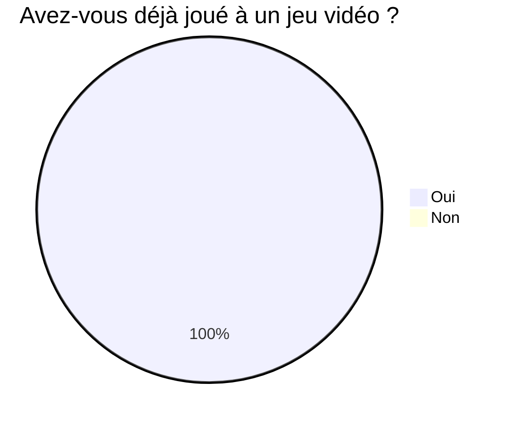
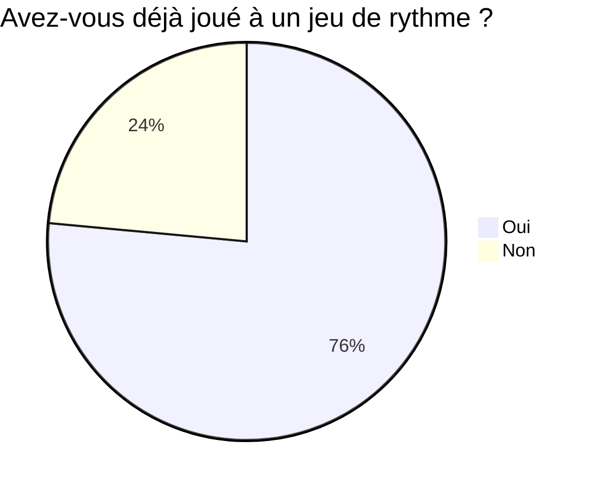
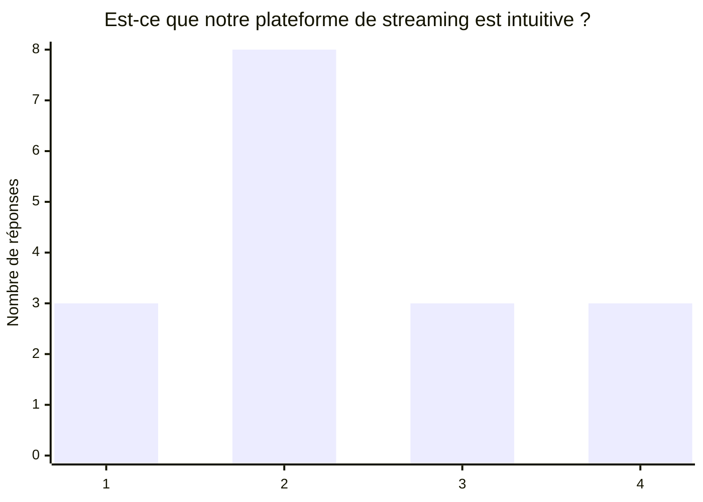
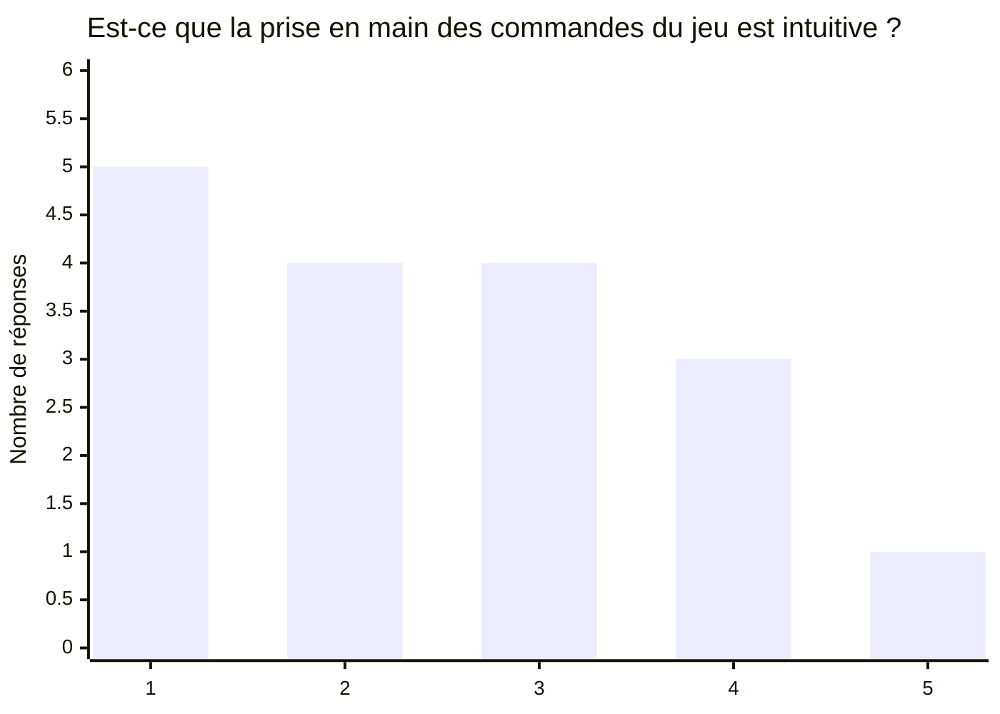
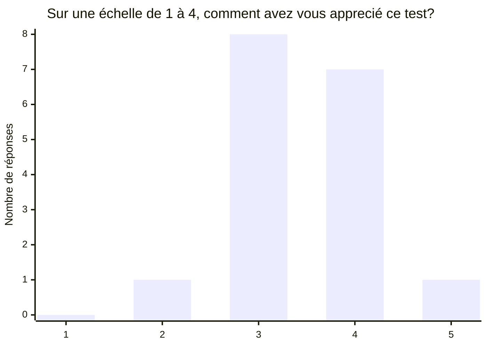

# Synthèse des tests utilisateurs
## Profil et veille concurentielle

Jeux de rythmes connus: GeometryDash, JustDance, Piano tiles, Osu...

Concurrent potentiel: GeometryDash

Mais il y a quelques différences notables:

- Jeu en 2D
- Pas de plateforme de streaming

## Déroulé du test

La plateforme de streaming et le jeu ne sont pas assez intuitifs

- Rendre l’interface de la plateforme de streaming plus claire
- Ajouter une explication des contrôles au début du niveau

## Ressentis de l'utilisateur

Ce que l’utilisateur a moins apprécié:

- Les bugs
- L’interface
- Manque de dynamisme du jeu
- Caméra

Ce que l’utilisateur a apprécié:

- Le concept/principe
- Le gameplay/jeu
- Le personnage
- Les dragons
- Pouvoir choisir sa musique (≠ GeometryDash)